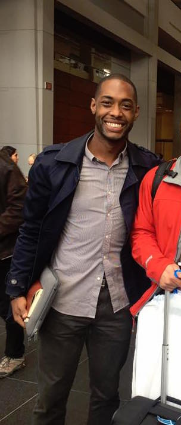

Hi folks. My name is Nathan and I am an assistant professor in the Howard University School of Education and the HU Center for Applied Data Science and Analytics (CADSA). I am looking forward to learning together and I encourage you to contribute your expertise during our time.

## Teaching

At Howard, I teach a variety of courses across the School of Education and CADSA. I hold a joint appointment in the `Department of Curriculum and Instruction`, where I teach math methods and international education, and in the `Program in Applied Data Science and Analytics`, where I teach courses in computation, probability, and statistical modeling.

## Research

Broadly, my research focuses on three strands: (1) the role of "context" in probability, statistics, and mathematical modeling, (2) how humans learn to use increasingly complex information to quantify things across the lifespan, and (3) Black diaspora studies in educator preparation. Starting in early childhood education all the way up to elderhood, I am also interested in how quantification informs decision-making, perspectives on the world, and critical computational practices[^1] in informal and non-traditional settings.

[^1]: Computational practices are the habits, behaviors, and working methods people use when solving problems with computers, like when using calculators or when coding.

Here are a few examples by strand (click on the text):

-   [The role of "context" in probability, statistics, and mathematical modeling](https://muse.jhu.edu/pub/417/article/981064){target="_blank"}

-   [How humans learn to use complex information to quantify things](https://doi.org/10.1080/29932955.2026.2709285){target="_blank"}

-   [Black diaspora studies in educator preparation](https://quant-shop.github.io/black-like-me/){target="_blank"}

## Lab

At Howard, I direct the [Quantitative Histories Workshop](https://quant-shop.github.io){target="_blank"}, which is a computational curriculum collective and community-centered teaching and learning lab.

At our core, our lab integrates high-dimensional data sets to analyze problems over long periods of time, like centuries. We then engage in what is called "uncertainty quantification" to test models that describe how much error we think is present in both our data and analysis.

We also engage in spatial data analysis and Black archival studies in our analysis of primary documents that relate to the use of mathematics, statistics, and data to advance racial, economic, and spatial justice.

-   [Here](https://rpubs.com/professornaite/crit-comp-geo-pt1){target="_blank"} is some of our work in spatial data analysis.

-   [Here](https://rpubs.com/professornaite/hidden-network-connections){target="_blank"} is a talk about our archival work on Black mathematicians.

You can find out more about me and my lab's research online [here](https://profiles.howard.edu/nathan-alexander){target="_blank"}.

{width="20%"}

If you have any questions or want to learn more, you can contact me via email: nathan \[dot\] alexander \[at\] howard \[dot\] edu
